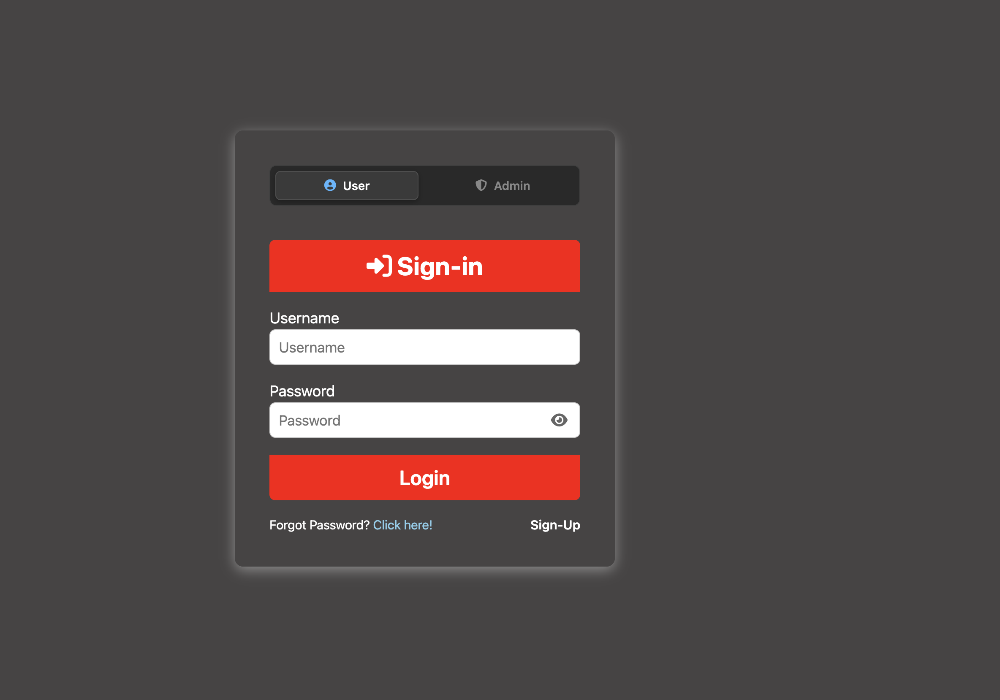
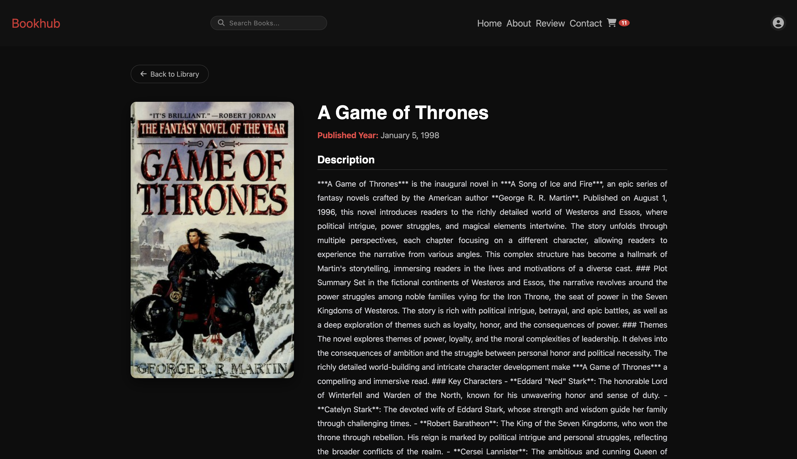
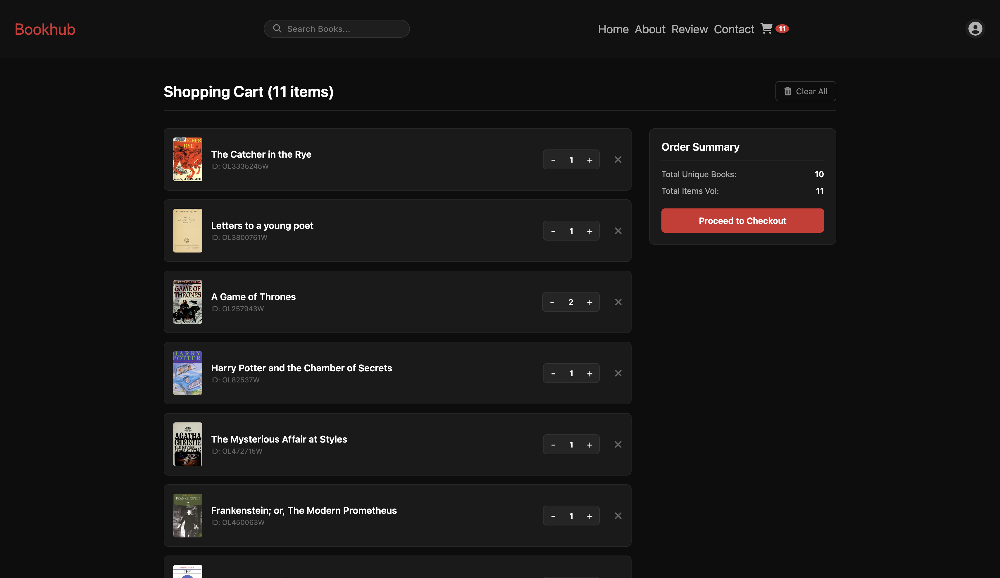

# BookHub

A simple React web application for browsing books, viewing their descriptions, and managing a shopping cart. Built as part of a Phase 2 project focusing on dynamic client-side routing and centralized state management.

>**Development History:** This repository represents **Phase 2** of the project, focusing on moving to a modular folder architecture, dynamic client-side routing, and centralized state management. You can find the original static prototype in the [Safal-E-Library (Phase 1)](https://github.com/Safal005/Safal-E-Library) repository.

## Project Outputs (Screenshots)

* **Main Dashboard:** Displays the grid layout of available books.

* **Login Page:** The entry point for user authentication.

* **Admin View:** Shows the elevated dashboard where users with admin rights can add or delete books from the inventory.

* **Book Description Page:** Displays the detailed information for a selected book.

* **Shopping Cart Page:** Displays the items added to the cart, dynamically updated using React Context.

## Built With

* React
* Vite
* React Router (Client-side routing)
* React Context API (Global cart tracking)
